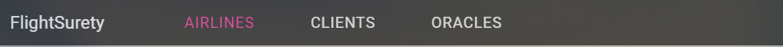
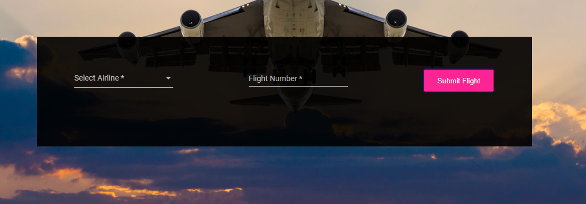
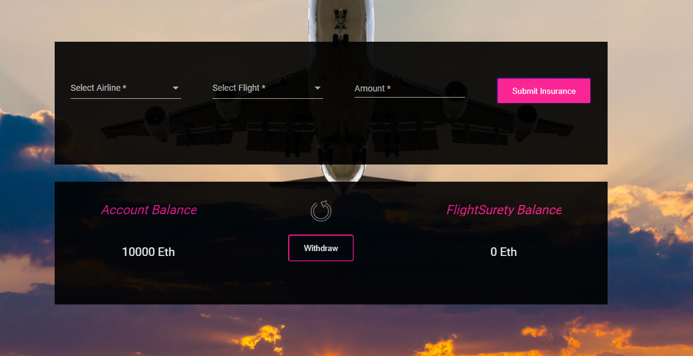
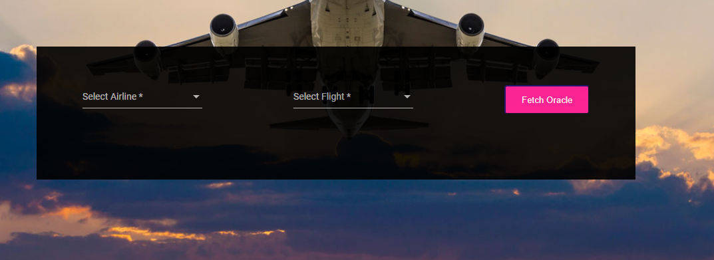

# FlightSurety

FlightSurety is a sample application project for Udacity's Blockchain course.
  
## Install
 
This repository contains Smart Contract code in Solidity (using Truffle), tests (also using Truffle), dApp scaffolding (using Angular) and server app scaffolding.

To install, download or clone the repo, then:

`npm install`

`cd truffle`

`truffle --netword dev compile`

  

## Develop and Deploy Project
 

### Develop Client
 
To run truffle tests:

<!-- `npm run truffleTest` -->
`cd truffle`
`truffle --netword dev test`

To use the dapp:

`cd truffle`
`truffle --netword dev migrate`
`cd ..`
`npm run dapp`

To view dapp:

`http://localhost:8000`
  

### Develop Server
 

`npm run server`

 

### Deploy
 
To build dapp for prod:
`npm run dapp:prod`

Deploy the contents of the ./dapp folder
  

## Frontend manuals
 
Three panels are composing the frontend interface to represent the three actors involved in the process:
  

 

### Airlines:
 

4 airlines will automatically be registered at the initialization of the page. 

> Please wait to see them on the select menue of the airlinesForm.

Select an airline and proceed to the registration of a flight for this airline. 

> The flight number must be a 5 letter word.

 

### Clients:
 

As a client you can pursue an insurance.
  

 

Select an airline and a flight.

Choose the amount of the insurance between 0 an 1 Eth.

Click the "Submit Insurance" button to buy the insurance.

2 account balances can be viewed on the pannel:

- the client personal account - which is, in this case, a ganache account.

- the client account that has been created in the flightSurety contract.

Once the flightSurety account is fill in with the insurance amount - due to a late departure, the client can withdraw this amount into it's ganache account by clicking on the withdraw button. 

> You need, for the moment, to refresh the page in order to see the change in the FligthSurety Balance.

> Transfer functions between Ganache accounts and contract account has not been set yet.

 

### Oracles:
 

 

The Oracles process will start when airline, flight have been selected and the user press on the "Fetch Oracle" button. 
- The fetch for flight status will be launched. 
- The server will receive the event and check which registered oracles match the index. The choosed oracles will then be allowed to respond sending a randomly choosen status.

- Once the contract get enough answers with the same code, it considers the status to be true and process accordingly.

- The client is finally credited on its flightSurety account to the due amount in case of late departure.
  

### Contract Status:
 

The contract status is represented by a circle in the nav Bar. It takes:
- a green color in case of "On status". 
- a red color when the status of the contract is off.
 

  

## Dependencies
  

    Angular: 13.2.7,
    nodemon: 2.0.19,
    truffle: 5.5.28,
    express: 4.18.1,
    http: 0.0.1-security,
    web3: 1.7.5,
    openzeppelin-solidity: 2.0,
 

## Resources
 

* [Get started with Angular?](https://angular.io/start)
* [Learn how to create your own Dapp with Angular 9](https://medium.com/blockchain-developer/learn-how-to-create-your-own-dapp-with-angular-part-i-688f24e0ad9e)
* [How does Ethereum work anyway?](https://medium.com/@preethikasireddy/how-does-ethereum-work-anyway-22d1df506369)
* [BIP39 Mnemonic Generator](https://iancoleman.io/bip39/)
* [Truffle Framework](http://truffleframework.com/)
* [Ganache Local Blockchain](http://truffleframework.com/ganache/)
* [Remix Solidity IDE](https://remix.ethereum.org/)
* [Solidity Language Reference](http://solidity.readthedocs.io/en/v0.4.24/)
* [Ethereum Blockchain Explorer](https://etherscan.io/)
* [Web3Js Reference](https://github.com/ethereum/wiki/wiki/JavaScript-API)
  

## To Do
 

### Web3
- Authentication mechanism with metamask signature.

### Solidity
- Fund() transfers funds to the contract's address.
- Modify view function to deserve frontend needs.

### Frontend
- Annimation for the withdraw arrow.
- Implement missing features:
    - screen airline's name instead of address.
- Reusable components - form, fields...
- Catch events and provok reactions or updates.
- Cache flights requests.

